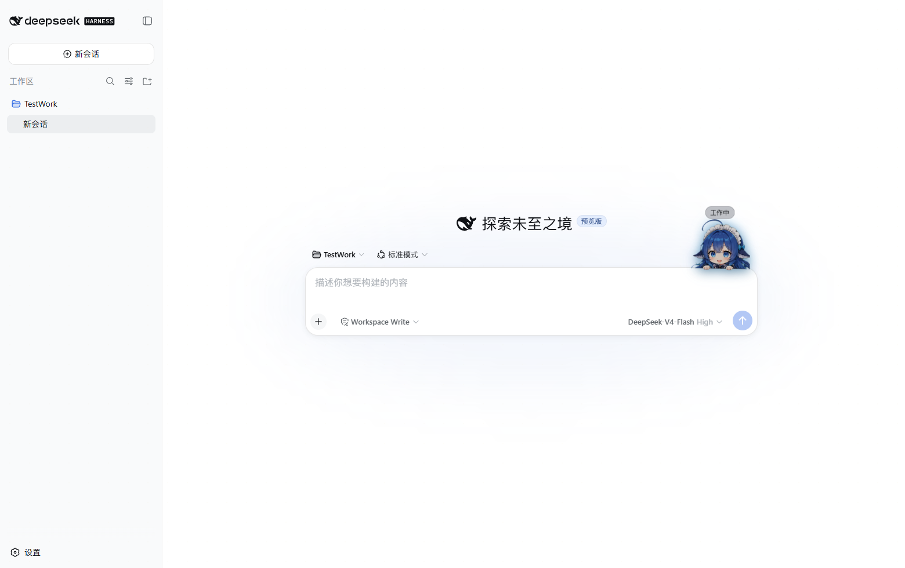

# 🐋 DSH Meme Hub

**A curated tour of the DeepSeek Harness (dsh) community's wildest plugins** 

English | [简体中文](README.zh-CN.md)

  <a href="https://dsh-meme-hub.cdqyfdbymn.me/">
    <b>🌐 Visit the website — dsh-meme-hub.cdqyfdbymn.me</b>
  </a>
   Browse plugins, memes &amp; one-click installs — full site below

  

> **Everything is a Plugin — so go tinker with anything.**

On August 13, 2026, DeepSeek open-sourced its agent harness [DeepSeek Harness](https://github.com/deepseek-ai/deepseek-harness) with a brutally simple slogan: **Everything is a Plugin**. 45,000+ stars in 24 hours. But the real show started afterwards: the community got the joke overnight — if everything is a plugin, then ads are plugins, skins are plugins, desktop pets are plugins, and yes, **even Excel is a plugin**.

Spammy web-game ads, QQ 2006, a God-of-Wealth jackpot wheel, hand-drawn pixel whales, a Deep-Sea Maid Atelier… meme density straight out of the 2005 Chinese internet.

This is an [Awesome List](https://github.com/sindresorhus/awesome)-style navigation repo: one line per project + one hand-picked screenshot (star counts are snapshots from the day of listing). No code, no install tutorials — just the fastest route to the funniest corners.

---

## 📖 The Companion Deep Dive

What does the plugin architecture behind this 24-hour meme carnival actually look like? And why did this community ignite so fast? 👉

[**china-ai-arbitrage.xyz · DSH's First 24 Hours: A Meme Census (companion long-read)**](https://www.china-ai-arbitrage.xyz/blog/dsh-meme-hub-24h)

Prefer browsing over reading? All 28 picks live on one page with screenshots, categories and one-click install commands 👉

[**Install DeepSeek Harness (dsh) Plugins — 28 Community Picks**](https://www.china-ai-arbitrage.xyz/dsh-hub)

---

## Contents

- [Peak Absurdity](#peak-absurdity)
- [Skins and Themes](#skins-and-themes)
- [Cyber Pets](#cyber-pets)
- [The Slack-Off Zone](#the-slack-off-zone)
- [Actually Useful](#actually-useful)
- [The No-Screenshot Club](#the-no-screenshot-club)
- [How to Get Listed](#how-to-get-listed)
- [Copyright](#copyright)

---

## Peak Absurdity

*Highest meme concentration. Enter at your own risk. Ads, parodies, nostalgia — if it touches one of these, it belongs here.*

- 📺 **[dsh-ads](https://github.com/Nagi-ovo/dsh-ads)** ★123 — "Bro, come kick me!" Turns DSH into a 2005-era Chinese web portal: knockoff web-game banners, a God-of-Wealth jackpot wheel, fake antivirus popups, corner ads — and a close button whose hitbox is smaller than it looks

  
  *Sidebar, chat, corners — all stuffed. The model keeps working in the background; your answers just have to sit through the ads first*

  
  *Recognize the format? Bro, come kick me*

  
  *One spin per turn, four progress bars to unlock. The ads are fake — your odds of winning V4 Pro are genuinely slim too*

- 📸 **[dsh-group-photo](https://github.com/SenmuuuuW/dsh-group-photo)** ★12 — The Polaroid wall from DSH beta's closing night: GitHub OAuth with zero scopes + a frozen whitelist. Pose once, stay on the wall forever

  
  *One Polaroid per person, one parting note each — the last night of the beta*

- 🐧 **[dsh-qq2006](https://github.com/LaplaceYoung/dsh-qq2006)** ★3 — DSH's web UI fully remodeled into a QQ 2006 client: 357 period-authentic assets, working skins, sound effects and login dialogs — with 1,561 tests all green

  
  *One second and you're back in 2006. Childhood DNA, activate*

- 📗 **[dsh-deepcel](https://github.com/Small-tailqwq/dsh-deepcel)** ★3 — DSH rebuilt as a spreadsheet: sessions, tools and settings all reconstructed as interactive cells. The model is literally filling out a form this time

  
  *Light and dark modes, full cell interactions — your boss would approve*

- 🏃 **[dsh-reasoning-effort](https://github.com/HanaAyane/dsh-reasoning-effort)** ★6 — A Codex-style model + reasoning-effort slider ported into DSH, plus a bonus fat-fish mode: drag a sprinting eight-frame fat fish to dial thinking intensity — the faster it runs, the harder the model thinks

  
  *Three levels — off / high / max — synced with DSH's /model command; flip one switch in settings and the plain white button turns into a sprinting fat fish*

- ⏰ **[dsh-liangwengu](https://github.com/mozhuanzuojing/dsh-liangwengu)** ★0 — DeepSeek API pricing peak/idle alert on Beijing time: a cartoon popup yells "Liang Wenfeng is coming, run!" at 08:55 and declares "Liangwengu is ONLINE!" at 12:00 and 18:00 — 30-minute countdowns, an HP bar that doubles as boiling water, a nine-realm cultivation ladder, full-screen ascension fireworks. Peak = price ×2, run; valley = half price, farm

  
  *The mascot that screams at you twice a day about your API bill*

---

## Skins and Themes

*Not every meme has to be absurd. Some people just want the whale girl to look nice.*

- 🎀 **[dsh-deep-whale](https://github.com/Small-tailqwq/dsh-deep-whale)** ★141 — Whale-girl skin series "Deep-Sea Maid Atelier" (maid-atelier): two maids tending the shop, deep-sea-blue lace UI + chibi sidebar, CC BY-NC-SA 4.0

  
  *Light and dark modes, lace-trimmed deep-sea blue — the whale girl deserves nothing less*

- 🖼️ **[dsh-plugin-background](https://github.com/gameswu/dsh-plugin-background)** ★3 — The DSH port of VSCode's background extension: independent backgrounds for chat / trace / sidebar / settings, with GIF and muted-video rotation

  
  *Per-image opacity, blur and rotation; crossfade transitions included*

- 🎮 **[gal-view](https://github.com/Ayase34/gal-view)** ★14 — Turn the chat screen into a visual novel: 16:9 stage, whale-girl maid sprite, ornate dialogue box, typewriter lines — plus a drag-and-drop scene editor that syncs straight back into play mode

  
  *DeepSeek as a blue-haired whale maid: "Please talk to me more, master"*

---

## Cyber Pets

*You write your code, I raise my whale. They come in many forms — some with more facial expressions than you.*

- 🐋 **[whale-girl](https://github.com/vlln/whale-girl)** ★28 — A whale girl in full QQ-Pet form: draggable, feedable, playable with. Finished tasks rack up seniority, titles and memories — and she sulks when one fails

  
  *15 states: blinking, wandering, napping, cheering, startled — she really is working alongside you*

- 🐳 **[dsh-ui-whale](https://github.com/lhh010/dsh-ui-whale)** ★16 — A fully hand-drawn pixel whale living in the session title bar: blinking, tail swishing, thinking animation, a water spout when a turn finishes, hearts when you click her — zero core modifications

  
  *Dozes off after 10 idle seconds, tail swishing frame by frame*

- 💻 **[dsh-pet](https://github.com/FlytoMAYDAY80/dsh-pet)** ★1 — A little whale desktop pet for macOS, with sound: always-on-top floating window, visible across fullscreen apps, senses session state even when DSH isn't open

  
  *Running, awaiting approval, task done — peripheral vision is enough, and it comes with sound*

- 🦀 **[dsh-plugin-pet-rs](https://github.com/HuanLinOTO/dsh-plugin-pet-rs)** ★1 — The same whale, rewritten in Rust: from ~100MB down to a sub-10MB target, covering Windows / macOS / Linux

  
  *5-state pixel whale + status bubbles. The author burned through their CI quota — build it yourself*

- 🪟 **[deepseek-harness-pet](https://github.com/wraven68/deepseek-harness-pet)** ★1 — A Windows desktop pet that reads your local DSH session logs only, showing current todo progress, status and task list right on your desktop buddy; standalone exe, no Python or Node needed

  
  *Left-click to drag, single click for the big task panel, Ctrl+scroll to zoom; read-only, uploads nothing — it sees every late-night line of code*
- 🐋 **[dsh-whale-musume](https://github.com/Sutera-Diffusus/dsh-whale-musume)** ★9 — An energetic whale girl: pat her head to raise affection, she grabs a laptop when you work and stays quiet late at night — 494 worker-bee dialogue lines, 30 achievements, pure frontend injection, zero telemetry

  
  *One-command bundle install, 38/38 CDP checks green — she really is working alongside you*

---

## The Slack-Off Zone

*Waiting for the model to reply is the hardest part. So someone did something about it.*

- ♟️ **[dsh-gomoku](https://github.com/omdsh-dev/dsh-gomoku)** ★6 — Gomoku against the AI in DSH's sidebar: zero search algorithms, every move is pure LLM reasoning. Dual-AI mode lets you spectate two models trying to destroy each other

  
  *Models and thinking budgets configurable per side; the board toggles in and out — slack off and stay productive, both at once*

> The true slack-off holy grail **[dsh-minigames](https://github.com/lhh010/dsh-minigames)** ★7 (18 offline mini-games) landed in the No-Screenshot Club below — its README ships without a single image.

---

## Actually Useful

*Memes aside, these genuinely get work done.*

- 🏠 **[dsh-web-ui](https://github.com/zhu1090093659/dsh-web-ui)** ★580 — The big collection of DSH Web UI plugins and skins: task board, Git graph, right panel, mobile remote control, whale-girl pet, live token stats, skin center. Install piecemeal or all at once

  
  *The task board runs on cron schedules; scan a QR code from your phone to take over the workspace*

- ⌨️ **[dsh-cc-tui](https://github.com/ccch1mneyyy/dsh-cc-tui)** ★252 — No official TUI yet? The community built one first: a Claude Code-style fullscreen terminal with a pixel-whale header, live status line, streaming thought expansion, double-Esc time travel — featured by the official WeChat account

  
  *Blue-and-white context progress bar + TPS gauge; mounts as a pure plugin, zero core changes*

- 🖥️ **[dsh-tianshu-tui](https://github.com/huiliyi37/dsh-tianshu-tui)** ★132 — Harness-level customization on top of the official TUI extension: TDD-driven agent workflows, evidence-gate delivery, image/vision bridging, and semantic code retrieval. Rendering core evolved from Tianshu-Tui with a pure presentation layer

  
  *Look, don't touch: the agent does its thing, the interface looks good doing nothing*

- 🪄 **[dsh-visualize](https://github.com/Nagi-ovo/dsh-visualize)** ★34 — DSH answers don't have to be text: the model calls `visualize` and interactive HTML cards render straight into the chat stream — simulators, charts, UI prototypes, all fair game

  
  *The dsh-ads author's one legitimate advertisement*

- 🧭 **[dsh-milestone](https://github.com/SnowCrescenter-tech/dsh-milestone)** ★12 — A milestone rail for your conversation: dotted timeline on the right, read it like a Git commit graph, jump to any question in one click

- 🎯 **[dsh-focus-chat](https://github.com/dingyi222666/dsh-focus-chat)** ★7 — A "focus chat" view for dsh: silence the process noise, show only final outputs

  
  *Everyday on the left, focused on the right — a minimal mode for results-only readers*

- 🖱️ **[dsh-web-review](https://github.com/CanglongCl/dsh-web-review)** ★7 — Review web pages like a design tool: circle elements in the built-in browser, annotate, tweak visuals on the fly — then the Agent edits the frontend source to match your annotations

  
  *Give feedback like a designer: circle it, change it*

- 📝 **[dsh-sticky-note](https://github.com/Meredith2328/dsh-sticky-note)** ★0 — Sticky notes on the composer toolbar: jot ideas as you go, auto-saved as Markdown, one click to send into the conversation

  
  *Inspiration runs faster than the session — write it down first*

---

## The No-Screenshot Club

*These projects ship READMEs without images. Click through and see for yourself.*

- 🧰 **[DSH-better-sidebar](https://github.com/omdsh-dev/DSH-better-sidebar)** ★169 `workhorse` — One plugin, one complete workbench: file manager, edit preview, embedded browser, real terminal, Git panel, background tasks — and third-party plugins can register new tabs
- 🏷️ **[ui-status-label](https://github.com/alingalingling/ui-status-label)** ★21 `skin` — Customize your whale girl's "deep diving" thinking status to literally anything you want. One setting line
- 🎮 **[dsh-minigames](https://github.com/lhh010/dsh-minigames)** ★7 `slack-off` — A mini-games panel on the right: 18 offline games, all hand-drawn on canvas — dino jump, Tetris, tank battle (with AI), Minesweeper, 2048, Sudoku, Pac-Man… the people who waited for 18 games deserved at least one screenshot
- 🎨 **[deepseek-harness-themes](https://github.com/orxz/deepseek-harness-themes)** ★1 `skin` — Community-maintained theme collection: colors and looks only, never touching models or agents — One harness. Multiple styles.
- 🖌️ **[dsh-skin](https://github.com/KinGao294/dsh-skin)** ★1 `skin` — The spiritual-successor-to-Codex skin switcher: 7 curated palettes + custom wallpaper. Two lines in settings, done
- 💰 **[dsh-balance-meter](https://github.com/Ghost011118/dsh-balance-meter)** ★0 `workhorse` — Live DeepSeek account balance + this session's spend in the composer dock; refreshes from the official price sheet every 6 hours, peak/off-peak changes included
- 🔦 **[dsh-spotlight](https://github.com/0xsline/dsh-spotlight)** ★0 `workhorse` — A keyboard-first command palette: slash commands, recent sessions, UI actions, plugin settings — one panel for all of it
- 📦 **[dsh-web-archive](https://github.com/renat3u/dsh-web-archive)** ★0 `workhorse` — Deep Sleeping... collapses all Think reasoning rows and tool cards into uniform little cards. Instant peace
- 🔔 **[dsh-web-attention-badge](https://github.com/Luaphes/dsh-web-attention-badge)** ★0 `workhorse` — When a session needs you, three places light up at once: frame badge, tab-title counter, and the whale favicon turns amber

---

## How to Get Listed

Built something new for DSH? **PRs welcome!** Skins, desktop pets, mini-games, or anything more abstract — attach the repo link and a one-line intro; bonus points for a hand-picked screenshot (projects without one wait in the No-Screenshot Club first).

## Copyright

All images in this repository are excerpted from the respective open-source projects' own READMEs and official preview materials; **copyright belongs to their original authors**. This repo is navigation and promotion only, and does not redistribute any source code or assets. If any inclusion infringes on your rights, open an issue and it will be removed promptly.

---

<b>32 projects listed · 24 hand-picked screenshots</b> The meme density is still rising

